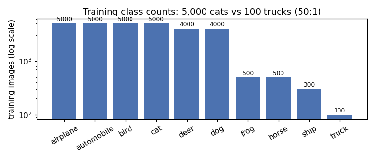

# ShiftGuard10: Robust Image Classification

EE708 course project, IIT Kanpur (Jan to Apr 2026). A Kaggle competition to classify 32x32 images
into 10 classes when the test images are deliberately shifted away from the training images. Our
team trained a WideResNet-28-10 from scratch with Balanced Softmax and square-root class
resampling, heavy augmentation, Stochastic Weight Averaging, a 3-seed ensemble and test-time
augmentation. The final submission placed 1st of 27 teams with a macro F1 of 0.9488.

The solution is `notebook.py`, unchanged from the team repository
[Xavaitron/Shiftguard10](https://github.com/Xavaitron/Shiftguard10) (final commit `9b1bac1`).
This repo adds an analysis of the dataset, the history of how the solution got there, tests, and
detailed notes ([interview_prep.md](interview_prep.md)).

## Competition objective

Predict one of airplane, automobile, bird, cat, deer, dog, frog, horse, ship, truck for each of
7,600 test images. Rules: competition data only, no pretrained weights or checkpoints, no external
data, notebook-based submission reproducible from scratch.
Details: [competition/competition_overview.md](competition/competition_overview.md).

## Dataset

29,400 training and 7,600 test images, 32x32 RGB PNG. The training classes are very unbalanced:

| airplane | automobile | bird | cat | deer | dog | frog | horse | ship | truck |
|---|---|---|---|---|---|---|---|---|---|
| 5,000 | 5,000 | 5,000 | 5,000 | 4,000 | 4,000 | 500 | 500 | 300 | 100 |



## Evaluation metric

Macro F1: F1 per class, averaged with equal weight, so the 100 trucks matter as much as the 5,000
cats. See [competition/evaluation.md](competition/evaluation.md).

## Key challenge

Measured after the competition ([docs/dataset_analysis.md](docs/dataset_analysis.md)):

- **Imbalance:** 50 to 1 between the largest and smallest training class.
- **Occlusion:** 5% of images in both sets carry a grey square of RGB (125, 123, 114): 6x6 in
  training, 10x10 in test.
- **Noise:** about 21% of training images and about 75% of test images carry colour noise; 38% of
  test images carry a strong level that almost never appears in training.
- **Class mix:** the test set is very probably tilted the other way. Every strong submission predicts
  about 500 images for each of the four biggest training classes and about 950 for each of the four
  rarest, and a balanced test set would cap those submissions below their actual scores
  (`python scripts/check_test_prior.py`).

## Approach

```
class-wise 95/5 split (27,930 / 1,470), split seed 42
  -> RandomCrop(32, pad 4), flip, AutoAugment (CIFAR10 policy), Normalize, Cutout 16
  -> WeightedRandomSampler with weight 1/sqrt(class count)
  -> MixUp or CutMix on 50% of batches (alpha 1.0)
  -> WideResNet-28-10 with Balanced Softmax loss and label smoothing 0.1
  -> SGD (lr 0.1, Nesterov momentum 0.9, wd 5e-4), gradient clipping 5.0,
     5 warmup epochs + cosine, 450 epochs, SWA from epoch 360 (SWALR 0.005)
  -> per seed: best validation epoch or the SWA average, whichever scores higher
  -> seeds 42, 137, 7
  -> per model: 1 clean view + 30 random views per test image, softmax averaged
  -> average over the 3 models -> submission.csv
```

## Architecture

WideResNet-28-10 written from scratch: pre-activation residual blocks, 3 groups of 4 blocks with
160 / 320 / 640 channels, dropout 0.3 inside each block, Kaiming normal init. 36,479,194
parameters. The image stays 32x32 through the first group, then 16x16 and 8x8, followed by global
average pooling and a linear layer. Details: [docs/architecture.md](docs/architecture.md).

## Training strategy

- SGD, lr 0.1, momentum 0.9, Nesterov, weight decay 5e-4, gradient norm clipped at 5.0.
- Batch size 128 in the version that trained the models (the final script's default is 512, set
  later when the script was reworked for Kaggle inference).
- 5 epochs of linear warmup, then cosine decay; 450 epochs per model.
- SWA over epochs 360 to 449 with SWALR (0.005); BatchNorm statistics recomputed with `update_bn`.
- Validation macro F1 every epoch; each seed keeps its best epoch or the SWA model, whichever is
  better on validation.

## Class imbalance strategy

1. **Sampler:** weight 1/sqrt(class count). Trucks go from 0.34% of the data to about 2.1% of the
   samples, about 6 draws per truck image per epoch. v2 used full inverse frequency (every class 10%,
   about 29 draws per truck image per epoch); v3 moved to the milder square root.
2. **Balanced Softmax:** the loss adds log(class frequency) to the logits during training; prediction
   uses the raw logits, which removes the training class prior from the decision.

The two overlap: together (and with label smoothing) they lean predictions towards rare classes more
than a balanced test set would need. Since the test set appears to be tilted towards those same
classes, that lean was probably helpful here, but it was not measured.

## Augmentation

Random crop with 4-pixel padding, horizontal flip, AutoAugment with the CIFAR-10 policy, and Cutout
with a 16-pixel square applied after normalisation (so the square is the mean grey, the same colour as
the dataset's occlusion patches). On half the batches the batch is mixed with MixUp or CutMix
(equal chance, alpha 1.0); for CutMix the label weight is recomputed from the actual pasted area.

## Ensemble and TTA

Three models (seeds 42, 137, 7) share the same validation split. At test time each model predicts on
the clean image plus 30 random light transformations (crop, flip, colour jitter of 10%, rotation up to
10 degrees); the 31 softmax outputs are averaged, then the three models are averaged with equal
weight. That is 93 forward passes per test image.

## Result

| version | change | macro F1 |
|---|---|---|
| v2 (24 Mar) | single WRN-28-10, full inverse-frequency sampler, 90/10 split, 300 epochs, 20 + 1 TTA views | 0.9348 (from the v3 code header) |
| v3 (final) | 3 seeds, sqrt sampler, 95/5 split, 450 epochs, SWA from 360, 30 + 1 TTA views | 0.9488, 1st of 27 teams |

v3 changed several things at once, so the 0.014 gain can't be attributed to one of them. No
controlled ablations were run. How the solution developed is in [history/README.md](history/README.md).

## Reproducibility

```bash
pip install -r requirements.txt
# put the data in data/ (see data/README.md)

python notebook.py --data-root data/shift-guard-10-robust-image-classification-challenge \
                   --checkpoint-dir checkpoints --batch-size 128   # train 3 models + predict
python -m pytest -q                       # CPU checks of shapes, split, sampler, loss, defaults
python scripts/analyze_dataset.py         # dataset statistics, occlusion and noise
python scripts/check_test_prior.py        # what the submissions say about the test class mix
python scripts/evaluate_checkpoints.py --ckpt-dir checkpoints --seeds 42 --tta 0   # measure TTA etc.
```

For the competition, the models were trained outside Kaggle with the 25 March version of the script,
and the Kaggle notebook loaded those self-trained checkpoints (attached as a Kaggle Model) and ran
inference only. `notebook.py` skips training for any seed whose checkpoint file already exists.

Known issues in `notebook.py`, kept as they were (details in
[docs/code_walkthrough.md](docs/code_walkthrough.md)):

- `python notebook.py --debug` crashes at the end of epoch 2 (`classification_report` needs a
  `labels` argument when fewer than 10 classes are present).
- `main()` skips training whenever a checkpoint file exists, without checking its `completed` flag,
  so an interrupted run is never resumed and its partial weights are used.
- In inference-only runs nothing is seeded, so the random TTA views differ slightly between runs.

## Project structure

```
notebook.py               the competition solution (unchanged team code)
submission.csv            final 3-seed predictions (from the team repo)
interview_prep.md         full notes: every decision, the maths, question bank, cheat sheet
competition/              competition overview and the metric
history/                  v2 and the training version of v3, earlier submissions, timeline
docs/                     walkthrough, architecture, code, design decisions, limitations, dataset analysis, provenance
configs/config.md         every setting and where its value comes from
scripts/                  dataset analysis, test class-mix check, checkpoint evaluation (post-competition)
notebooks/                executed notebooks: data exploration, code checks
tests/                    CPU tests against notebook.py
results/                  dataset statistics and charts
data/                     put the competition data here (not committed)
```

Sample images are not included because the competition rules do not allow redistributing the data;
the scripts and notebooks show them when run locally.

## Important limitations

- No controlled ablations; the only before/after number is v2 to v3, with six changes at once.
- Validation has only 5 trucks and 15 ships (one truck mistake moves macro F1 by about 0.011), and it
  comes from the training distribution, not the shifted test distribution.
- Nothing in training adds pixel noise, although noise is the most common test perturbation.
- The test class mix was never estimated explicitly; the prior correction aims at a uniform mix.
- About 60 hours of training (per the notebook header) and 93 forward passes per test image.

Full list: [docs/limitations.md](docs/limitations.md).

## Credits

The competition code and its history are from the team repository
[Xavaitron/Shiftguard10](https://github.com/Xavaitron/Shiftguard10) (commits by Pratyush Singh). The
dataset analysis, tests and documentation in this repo were added afterwards.
