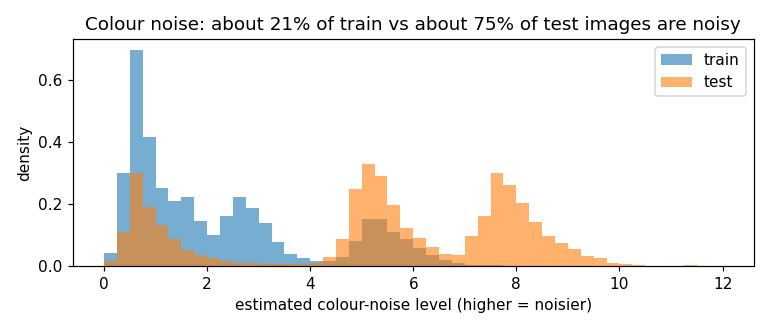

# Dataset analysis

Everything here was measured on the competition ZIP with
`python scripts/analyze_dataset.py` (output in `results/dataset_stats.json` and
`results/figures/`). This analysis was done after the competition, to understand the
shift properly. It was not part of the competition notebook.

## Basic facts

| | train | test |
|---|---|---|
| images | 29,400 | 7,600 |
| size | 32 x 32, RGB, PNG | 32 x 32, RGB, PNG |
| labels | `train_labels.csv` | hidden |
| exact duplicate images | 0 | 0 |
| test images identical to a train image | | 0 |

`sample_submission.csv` has all 7,600 test ids with the label `airplane` everywhere, so
it is only a template.

## Class imbalance (verified)

| class | train images | share |
|---|---|---|
| airplane | 5,000 | 17.0% |
| automobile | 5,000 | 17.0% |
| bird | 5,000 | 17.0% |
| cat | 5,000 | 17.0% |
| deer | 4,000 | 13.6% |
| dog | 4,000 | 13.6% |
| frog | 500 | 1.7% |
| horse | 500 | 1.7% |
| ship | 300 | 1.0% |
| truck | 100 | 0.34% |

Largest to smallest is 50 to 1. Six "head" classes hold 28,000 images (95.2%); four
"tail" classes hold 1,400 (4.8%).

## What the test class mix probably is (inference with strong evidence)

Test labels are hidden. The team repository's history has three submissions from strong
models (`python scripts/check_test_prior.py`):

| class | v2 (scored 0.9348) | v3 2-seed | v3 3-seed (final) |
|---|---|---|---|
| airplane | 534 | 524 | 520 |
| automobile | 553 | 553 | 537 |
| bird | 525 | 519 | 510 |
| cat | 549 | 570 | 554 |
| deer | 814 | 801 | 805 |
| dog | 876 | 812 | 818 |
| frog | 946 | 962 | 972 |
| horse | 913 | 937 | 932 |
| ship | 982 | 983 | 979 |
| truck | 908 | 939 | 973 |

For each class, F1 is at most 2 x min(predicted, true) / (predicted + true). If the test set
were balanced (760 per class), these files could score at most 0.880, 0.881 and 0.875. v2 scored
0.9348 (stated in the code) and the final 0.9488, so the test set is very probably not balanced.
If it had the training mix (50:1), the cap would be about 0.48. All three models agree on the
shape: about 500 for each of airplane, automobile, bird, cat; about 800 for deer and dog; about
950 for each of frog, horse, ship, truck. One design that fits and sums to exactly 7,600 is
500 x 4 + 800 x 2 + 1,000 x 4 (a guess).

So the shift includes a reversed label shift: the four rarest training classes (4.8% of training
images) are probably around half of the test set. Earlier models without strong rebalancing fit
this picture: a WRN with plain cross-entropy predicted 447 trucks, and the March CCT/LDAM-era
submission predicted 224.

Caveat: these counts come from the models' own predictions, so they can't be used to check
whether the models over-predict rare classes. They do rule out a balanced test set.

An earlier version of these notes guessed "roughly balanced" from 7,600 = 10 x 760. The
submissions above replace that guess.

## Partial occlusion (verified)

Some images contain a solid square of exactly RGB (125, 123, 114). That colour is the
CIFAR-10 mean colour (0.4914, 0.4822, 0.4465) times 255.

| | images with a patch | patch size | share of image area |
|---|---|---|---|
| train | 1,470 (5.00%) | always 6 x 6 | 3.5% |
| test | 380 (5.00%) | always 10 x 10 | 9.8% |

The same fraction of images is occluded in both sets, but test patches cover almost
three times the area. Training occlusion is spread evenly over classes (between 3.3% and
7.0% of each class).

Link to the solution: `Cutout(length=16)` runs after normalisation, so the masked
pixels become 0 in normalised space, which is exactly this same mean colour. Cutout
squares are up to 16 x 16 (expected area about 196 pixels, 19% of the image), so in
training the model regularly saw grey squares larger than the 10 x 10 test patches.

## Colour noise (measured with an estimator, so treat sizes as approximate)

Method: the Immerkaer noise estimate (a 3x3 high-pass filter) applied to the colour
difference channels R-G and B-G. Natural texture such as grass or fur looks similar in
R, G and B, so it mostly cancels in these differences. Independent per-pixel colour noise
does not cancel. This separates added noise from busy but clean images.

| | clean (< 3.5) | mild noise (3.5 to 6.5) | strong noise (>= 6.5) |
|---|---|---|---|
| train | 79.1% | 20.0% | 0.9% |
| test | 24.8% | 36.8% | 38.4% |

The histogram has clear separate bumps: clean images near 0.7, a mild-noise bump near 5
that exists in both sets, and a strong-noise bump near 8 that is almost only in test.
Adding Gaussian noise to clean training images and measuring the same statistic, the
test noise corresponds to a per-pixel standard deviation of roughly 3.5 to 6 on the
0-255 scale. That conversion is approximate; the organisers did not publish the noise
type.

Also checked on the gray channel (no colour split): median noise estimate 4.81 in train
vs 7.28 in test. Even the noisiest training class (frog, median 6.31, lots of texture)
is below the test median.

## Things that did not shift

Average colour and contrast are almost identical (float64 means over all pixels):

| | mean R, G, B | std R, G, B |
|---|---|---|
| train | 0.4925, 0.4832, 0.4474 | 0.2467, 0.2428, 0.2614 |
| test | 0.4940, 0.4841, 0.4476 | 0.2454, 0.2413, 0.2596 |
| CIFAR-10 constants used in code | 0.4914, 0.4822, 0.4465 | 0.2470, 0.2435, 0.2616 |

So using the CIFAR-10 normalisation constants costs nothing here. The match to CIFAR-10
statistics, the class names and the 5,000 cap per class are all consistent with the
images coming from CIFAR-10, but nothing in the competition files says so, so do not
claim it.

Some images in both sets look blurred. I could not separate a deliberate blur from
naturally soft photos, so blur is not claimed as a perturbation.

## Samples

Image grids (random train and test images, occluded images, the noisiest test images) are
produced by `scripts/analyze_dataset.py` into `results/local/` and shown in
`notebooks/01_dataset_exploration.ipynb` when run locally. They are not committed, because the
competition rules do not allow redistributing the data.

## Summary of the shift

| shift | evidence | strength |
|---|---|---|
| label shift: 50:1 train, tail-heavy test (about 500 per big class, about 950 per rare class) | predicted counts of three strong submissions vs their scores | strong inference |
| larger occlusion: 6x6 in train, 10x10 in test, both on 5% | exact pixel match | verified |
| more and stronger colour noise: 21% mildly noisy train, 75% noisy test, 38% strongly | noise estimator, clear separate modes | measured |
| colour and brightness | means and stds match | no shift |
